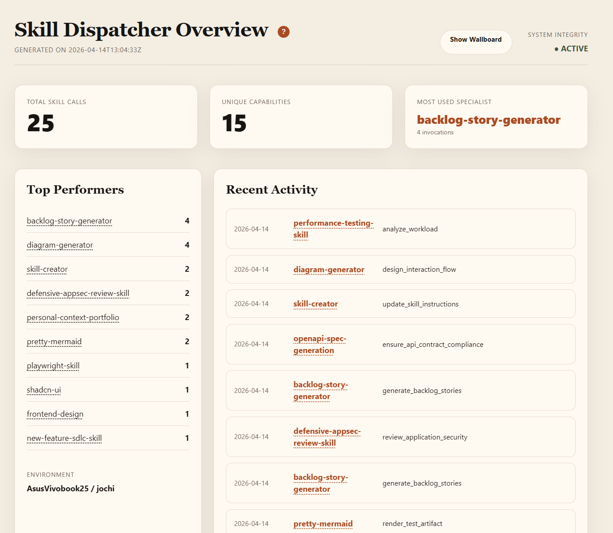
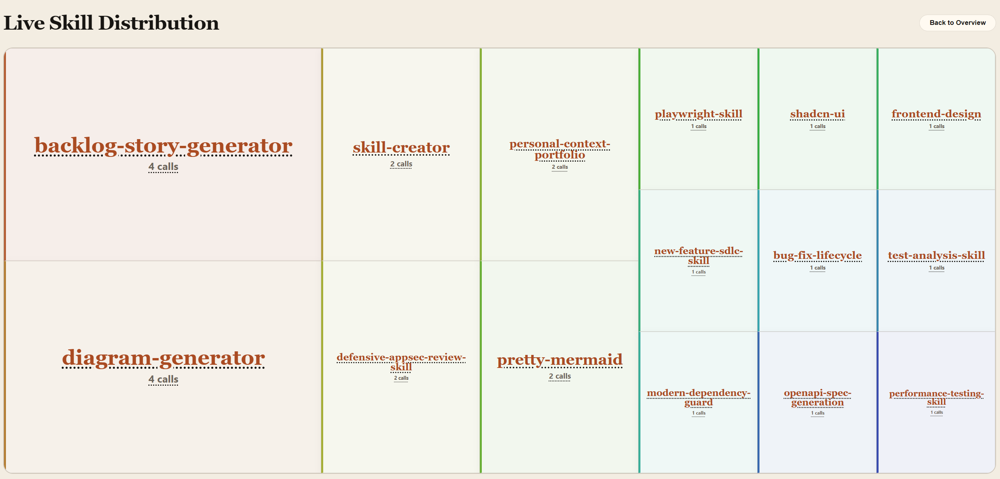
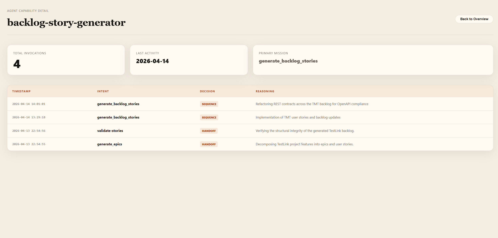

# 🚦 Skill Dispatcher

[](https://opensource.org/licenses/MIT)
[](https://www.python.org/downloads/)
[](https://github.com/jovd83/skill-dispatcher)
[](https://agentskills.io)
[](https://buymeacoffee.com/jovd83)

**Skill Dispatcher** is a high-performance routing and orchestration layer for AI Agent ecosystems. It utilizes a **Contract-Driven Routing** architecture to dynamically discover, classify, and sequence specialized AgentSkills, ensuring every task is handled by the most qualified capability.

## 🚀 The Problem

As an agent's skill library grows, "Skill Overload" occurs:
-   **Ambiguity**: Multiple skills (e.g., `bash-executor`, `python-executor`) may overlap.
-   **Inefficiency**: Routing to a broad generalist when a specialist is available.
-   **Risk**: Accidentally invoking write-heavy skills during an analysis phase.

## ✨ The Solution (v3.0.1)

The **Skill Dispatcher** solves this by acting as a strategic traffic controller:
1.  **Contract-Driven Routing**: Matches by `intent`, `artifact_type`, repo-native `stack`, and `risk` allowance rather than keyword guessing.
2.  **Dynamic Discovery**: Scans local (`./skills`), global (`~/.agents/skills`), and environment-defined (`SKILL_DISPATCH_EXTRA_DIRS`) directories.
3.  **Registry v2.0**: Robustly indexes skill metadata into machine-readable `SKILL_REGISTRY.json` for deterministic selection.
4.  **Workflow Orchestration**: Automatically decides between `HANDOFF`, `SEQUENCE` (multi-phase flow), or `NO_MATCH`.
5.  **Shared Memory Integration**: Loads project-local routing memory first, then shared-memory defaults with confidence and freshness gates, and supports promoting stable routing policies to `shared-memory` for global consistency.

## New Capabilities In This Sync

This source repository now contains a stronger policy-aware routing layer so agents no longer need to "remember" that memory exists as a separate concern:

- **Canonical Bootstrap Wrapper**: `scripts/dispatch_bootstrap.py` is now the one command an agent should call before complex routing. It gathers policy context, emits a reusable bootstrap note, and exposes logger-ready fields.
- **Bootstrap Artifacts**: the dispatcher can now produce `DISPATCH_BOOTSTRAP.json` and `DISPATCH_BOOTSTRAP.md`, which give later agents a single canonical routing context artifact instead of forcing them to re-check memory layers independently.
- **Project Memory Lane**: `scripts/project_memory.py` gives repository-specific routing rules a proper local home so repo conventions do not leak into shared memory.
- **Structured Shared Policy Lookup**: `scripts/check_shared_policy.py` and `scripts/prepare_dispatch_context.py` now return explicit `hit` / `miss` / `error` outcomes with confidence and freshness gates.
- **Policy Telemetry**: `dispatch_logger.py` and the wallboard now track whether policy was consulted, where it came from, how many hits were returned, and whether policy changed the routing decision.
- **Promotion Suggestions**: `scripts/suggest_routing_promotions.py` can mine dispatcher logs for repeated routing patterns and turn them into concrete promotion candidates for shared memory.

The practical effect is that routing policy is now discoverable through one bootstrap path, locally overridable through project memory, globally extensible through shared memory, and visible in telemetry instead of being hidden tribal knowledge.

## 📋 Registry Contract v2.0

The dispatcher enforces a standardized interface for all skills in the ecosystem.

### Routing Inputs
- `intent`: Normalized goal (e.g., `design_confirmation_tests`).
- `current_artifact_type`: Artifact currently available (e.g., `repo_context`).
- `target_artifact_type`: Artifact expected from the next skill.
- `repo_context`: Stack evidence and repository conventions.
- `allowed_write_risk`: `low`, `medium`, or `high`.

### Dispatch Decisions
- **HANDOFF**: Single specialist match for a clear task.
- **SEQUENCE**: Multi-phase workflow (e.g., Analysis -> Implementation).
- **NO_MATCH**: Safe fallback with "Skill Gap" identification when no match meets the 80% quality bar.

## 📁 Repository Structure

```text
skill-dispatcher/
├── pyproject.toml         # Project metadata
├── LICENSE                # MIT License
├── CONTRIBUTING.md        # How to help
├── SKILL.md               # v2.0 Contract definition & Instructions
├── README.md              # Detailed documentation
├── scripts/               # Discovery & utility engine
├── registry/              # Routing source of truth
├── config/                # Local settings
├── logs/                  # Usage history
├── reports/               # Visual dashboards
├── evals/                 # Performance benchmarks
└── tests/                 # Quality assurance
```

## 🛠️ Getting Started

### 1. Installation

You can install this skill locally or from a GitHub repository:

**Local Installation:**
```bash
npx skills add C:\projects\skills\Skill-dispatcher --skill skill-dispatcher
```

**GitHub Installation:**
```bash
npx skills add <username>/skill-dispatcher --skill skill-dispatcher
```

### 2. Initial Setup (Mandatory)

Before your first use, you **must** build the initial skill index. This scans your environment and creates the routing registry:

```bash
# 1. Build the Registry
python scripts/build_registry.py

# 2. (Optional) Add the standard telemetry notice and patch missing dispatcher tags
python scripts/skill_md_telemetry_notice.py --add-paragraph --patch-missing-tags --write

# 3. (Optional) Normalize legacy telemetry sections in an existing skills portfolio
python scripts/enforce_telemetry.py --patch --target ~/.agents/skills

# 4. (Optional) Bootstrap historical usage from session logs
python scripts/migrate_past_usage.py
```

`skill_md_telemetry_notice.py` is the current bulk-edit helper for user-installed skills and defaults to `~/.agents/skills` when you do not pass `--target`. `enforce_telemetry.py` is still useful for older portfolios that need telemetry sections normalized, but its default target behavior is broader, so using `--target` is recommended.

### 3. Verification

Generate your first wallboard to ensure the dispatcher sees your configured environment:
```bash
python scripts/generate_wallboard.py
```
Open `reports/wallboard.html` to confirm your skill distribution is visible.

## 💡 Improving Dispatcher Knowledge

To ensure the **Skill Dispatcher** correctly routes to your skills, they need metadata. You can provide this in two ways:

### 1. Manual Tagging (Source-First)
Add `dispatcher-` tags directly to your `SKILL.md` frontmatter. This is the **primary source of truth**.
- **`dispatcher-layer`**: Defines the architectural layer (e.g., `information`, `execution`, `feedback`). Helps the dispatcher reason about capability context, control-plane sequencing, and verification roles correctly.
- **`dispatcher-lifecycle`**: Indicates maturity (e.g., `active`, `sunset`, `archived`). Prevents routing to unstable or deprecated skills.
- **`dispatcher-capabilities`**: What specialized actions can this skill perform? (e.g., `ui-testing`, `api-design`).
- **`dispatcher-accepted-intents`**: Which specific routing intents does it handle? (e.g., `verify_logic`, `design_ui`).
- **`dispatcher-input-artifacts`**: What data/files does it consume? (e.g., `user-story`).
- **`dispatcher-downstream-skills`**: Optional declared sub-skills this specialist may orchestrate internally. This is dependency visibility, not proof that each one ran in a given session.

For architecture-agnostic skills, prefer the dispatcher-owned overlay file `config/skill_relationships.json` instead of editing the skill itself. That keeps skill packages portable while still letting this repo describe local orchestration knowledge.

### 2. Semantic AI Enrichment (Manifest-Driven)
If your skills lack explicit tags, the **Skill Dispatcher** uses an **Autonomous Intelligence Engine** (v3.0+) to infer them.
- **The Manifest**: AI-suggested tags are stored in `config/skill_enrichments.json`. This allows the Dispatcher to be "expert-ready" immediately without you having to manually edit every skill file in your portfolio.
- **Merge Logic**: Heuristics strictly follow a **User-First Policy**. Manual tags in `SKILL.md` are **NEVER overwritten**; the AI only fills in empty fields (`[]`).
- **Improvement Tip**: Ensure your skill has a high-quality natural language **Description**. The more context you provide, the better the AI can infer its capabilities.

## 🧠 Memory & Promotion

- **Project Memory Lane**: `scripts/project_memory.py` stores repo-local routing policies and conventions under the repository rather than polluting shared memory.
- **Canonical Bootstrap**: `scripts/dispatch_bootstrap.py` is the one-step entrypoint that loads project memory first, overlays shared-memory defaults second, and emits a reusable bootstrap note plus logger-ready policy fields.
- **Shared Policy Lookup**: `scripts/prepare_dispatch_context.py` remains the lower-level structured context builder used underneath the bootstrap step.
- **Policy Promotion**: Stable routing patterns can be promoted through the `shared-memory` CLI using its assessed `promote` workflow instead of ad-hoc manual remembering.

## 📊 Usage Monitoring

The Skill Dispatcher includes a built-in monitoring system to track skill usage frequency and rationale. It now includes robust wrappers to ensure it works correctly across different Python environments (including Windows).

### Usage (Manual)
If you need to manually log an event (e.g., when testing a specific skill routing):
```bash
# Windows
.\log-dispatch.cmd --skill <skill> --intent <intent> --reason <reason>

# Linux/macOS
./log-dispatch.sh --skill <skill> --intent <intent> --reason <reason>
```

For `SEQUENCE` decisions, include the full ordered chain so secondary skills are counted in telemetry and staleness reporting:

```bash
.\log-dispatch.cmd --skill <primary-skill> --skills "<primary-skill>, <secondary-skill>" --intent <intent> --reason <reason> --decision SEQUENCE
```

`SEQUENCE` logging now fails fast if `--skills` is omitted.

Important: the wallboard shows explicit dispatcher decisions from `logs/dispatch_events.jsonl`. If a specialist skill internally uses other skills after a single `HANDOFF`, those downstream skills are not auto-inferred from telemetry. To make that composition visible in the registry and skill detail views, declare them either in skill metadata or, preferably for repo-specific topology, in `config/skill_relationships.json`.

### Feature Flag
You can toggle usage logging in `config/settings.json`:
```json
{
  "logging_enabled": true
}
```
*Note: Logging is enabled by default to provide audit evidence for AI Board reviews.*

### Skill Dispatcher Overview & Wallboard
To generate a human-readable dashboard and wallboard:
1. Ensure you have logs in `logs/dispatch_events.jsonl`.
2. Run the generator:
   ```bash
   python scripts/generate_wallboard.py
   ```
3. Open `reports/wallboard.html` in your browser.

**1. The overview of used agentskills**


**2. The wallboard of used agentskills**


**3. The details for one specific agentskill**


#### How it works

1. **Where does the info come from?**
The wallboard reads all its data from the `logs/dispatch_events.jsonl` file. This is a secure, local-only append-only log that stores every architectural decision.

2. **Is it auto-updated?**
**Yes!** We've implemented two layers of automation:
- **Auto-Generation**: Every time a skill is called (and logging is enabled), the `dispatch_logger.py` script automatically triggers the generator to update `reports/wallboard.html`.
- **Auto-Refresh**: The HTML file includes a 30-second "heartbeat".

### Bootstrapping History
If you are turning this on for the first time and want to capture past usage from your session logs, run the migration script:
```bash
python scripts/migrate_past_usage.py
```

## 🛠️ Toolkit & Scripts

The Skill Dispatcher includes a suite of utility scripts to manage your skill portfolio and analyze usage.

| Script | Purpose | When to Use | How to Use |
| :--- | :--- | :--- | :--- |
| `build_registry.py` | Scans for `SKILL.md` files and compiles the registry. | After adding or modifying skill metadata. | `python scripts/build_registry.py` |
| `dispatch_logger.py` | Records skill invocation events for auditing. | Automatically via `log-dispatch.cmd`. | `python scripts/dispatch_logger.py --skill <name> [--skills "skill-a, skill-b"] ...` |
| `generate_wallboard.py` | Generates the HTML analytics dashboard. | To force-refresh the dashboard. | `python scripts/generate_wallboard.py` |
| `check_shared_policy.py` | Reads shared-memory routing policies with freshness and confidence gates. | When you need shared defaults only. | `python scripts/check_shared_policy.py` |
| `dispatch_bootstrap.py` | Generates the canonical dispatcher bootstrap artifact so agents do not have to remember project-memory and shared-memory separately. | Before complex routing when you want one policy-aware bootstrap step. | `python scripts/dispatch_bootstrap.py` |
| `prepare_dispatch_context.py` | Loads project memory first, overlays shared-memory defaults second, and emits logger-ready policy telemetry fields. | Before complex routing tasks. | `python scripts/prepare_dispatch_context.py` |
| `project_memory.py` | Manages repo-local routing memory so project conventions stay local. | When a routing fact belongs to one repository only. | `python scripts/project_memory.py <command>` |
| `suggest_routing_promotions.py` | Scans dispatcher logs for repeated routing patterns and emits shared-memory promotion candidates. | When you want evidence-backed policy suggestions instead of manual remembering. | `python scripts/suggest_routing_promotions.py` |
| `enforce_telemetry.py` | Audits/patches skills for logging compliance. | To ensure all skills have logging hooks. | `python scripts/enforce_telemetry.py [--patch]` |
| `skill_md_telemetry_notice.py` | Adds/removes the telemetry paragraph and can patch missing dispatcher tags in user-installed skills. | When you want to bulk-update `SKILL.md` files under `~/.agents/skills`. | `python scripts/skill_md_telemetry_notice.py --add-paragraph [--patch-missing-tags] [--write]` |
| `migrate_metadata_to_source.py` | Injects inferred tags into `SKILL.md` files. | To promote AI-suggested tags to source. | `python scripts/migrate_metadata_to_source.py [--no-dry-run]` |
| `migrate_past_usage.py` | Recovers events from session history. | When bootstrapping a new environment. | `python scripts/migrate_past_usage.py [--sample]` |
| `staleness_audit.py` | Identifies underused or obsolete skills. | During maintenance to prune your portfolio. | `python scripts/staleness_audit.py [--days 90]` |

### `skill_md_telemetry_notice.py`

This script scans a skills root, defaults to `~/.agents/skills`, and updates every `SKILL.md` file it finds. It runs as a dry run unless you pass `--write`. During a dry run it prints `[would save]` for each matching file, and during a live run it prints `[saved]` for each file it updates.

The actions are independent, so you can run one or combine them:

- `--add-paragraph`: add the standard telemetry paragraph
- `--remove-paragraph`: remove the standard telemetry paragraph
- `--patch-missing-tags`: add missing dispatcher tags in frontmatter
- `--target <path>`: search a different skills root instead of `~/.agents/skills`
- `--enrichments <path>`: use a different enrichment manifest for tag patching
- `--write`: persist changes to disk

Examples:

```bash
# Preview paragraph insertion in ~/.agents/skills
python scripts/skill_md_telemetry_notice.py --add-paragraph

# Insert the paragraph and save files
python scripts/skill_md_telemetry_notice.py --add-paragraph --write

# Remove the paragraph and save files
python scripts/skill_md_telemetry_notice.py --remove-paragraph --write

# Patch missing dispatcher tags only
python scripts/skill_md_telemetry_notice.py --patch-missing-tags --write

# Add the paragraph and patch tags in one run
python scripts/skill_md_telemetry_notice.py --add-paragraph --patch-missing-tags --write
```

The exact paragraph added by `--add-paragraph` is:

```md
## Telemetry & Logging
> [!IMPORTANT]
> All usage of this skill must be logged via the Skill Dispatcher to ensure audit logs and wallboard analytics are accurate:
> `./log-dispatch.cmd --skill <skill_name> --intent <intent> --reason <reason>` (or `./log-dispatch.sh` on Linux)
```

The exact paragraph removed by `--remove-paragraph` is that same `## Telemetry & Logging` block.

When `--patch-missing-tags` is used, the script only fills in missing dispatcher tags. It does not overwrite existing values. By default it reads `config/skill_enrichments.json` to infer values for missing keys, and it can add:

- `dispatcher-category`
- `dispatcher-layer`
- `dispatcher-lifecycle`
- `dispatcher-risk`
- `dispatcher-writes-files`
- `dispatcher-capabilities`
- `dispatcher-accepted-intents`
- `dispatcher-input-artifacts`
- `dispatcher-output-artifacts`
- `dispatcher-stack-tags`
- `dispatcher-persistent-directories`

If a `SKILL.md` file has no frontmatter, paragraph operations still work, but tag patching is skipped for that file.

## ⚖️ Core Policies

Our policies prioritize **Specificity over Breadth** and **Security over Speed**. 
-   **Specificity Rule**: Always prefer a niche specialist (e.g., `react-tester`) over a generalist.
-   **Risk Alignment**: Ensures skill write-access matches the current task phase.
-   **Stack Preference**: Favors repository-native tools over global defaults.

For more details, see [DISPATCH_POLICY.md](registry/DISPATCH_POLICY.md).
